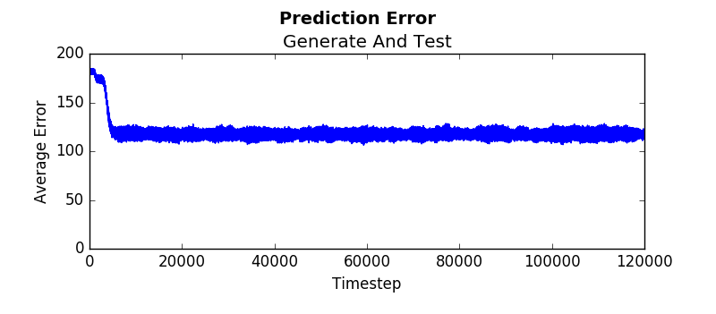

# Heading

## Subheading

### Sub sub heading

### External Link 
[Horde](https://www.cs.swarthmore.edu/~meeden/DevelopmentalRobotics/horde1.pdf)

### Image


### Python example embedded

```python
def tdLearn(self, lastState, newState):
	#Get the cumulant and lambda values
        zNext = self.cumulant(newState)  #returns bit value
        gammaNext = self.gamma(newState) #always returns 0
        lam = self.lam(newState) #always returns 0.95

        #Update weights
        self.eligibilityTrace = self.gammaLast 
        * lam * self.eligibilityTrace + lastState
        tdError = zNext + gammaNext * 
        numpy.inner(newState, self.W) 
        - numpy.inner(lastState, self.W)
        self.W = self.W + self.alpha * 
        tdError * self.eligibilityTrace
        self.gammaLast = gammaNext
```

### Pseudocode embed
```
GVF(X) = 1 if X^T W  > 0.7
GVF(X) = 0 otherwise
```