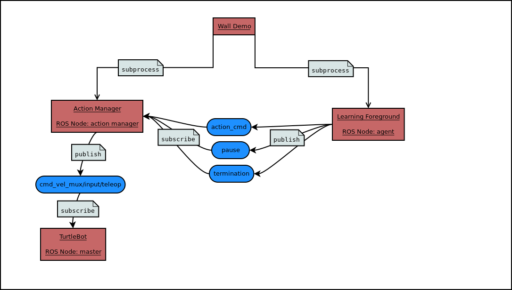

Code Overview
=============

The general structure of the code is shown in the figure below.

The :py:mod:`wall_demo_example` file creates two ROS nodes as subprocesses which are found in :py:mod:`learning_foreground` and :py:mod:`action_manager`. The :py:class:`learning foreground <LearningForeground>` gathers data from sensors and chooses actions, which it publishes to the ``action_cmd`` ROS topic. It can also publish auxiliary information to the ``pause`` or ``termination`` topics. The :py:class:`action manager <ActionManager>` subscribes to these topics and publishes the action to the ``cmd_vel_mux/input/teleop`` topic, which the ``Turtlebot`` uses to determine its actions.

Below are general descriptions of the major modules. More technical documentation can be found by clicking their names.

:py:mod:`Wall Demo Example <wall_demo_example>`
-----------------------------------------------

This is the primary python file that one will run in order to start the wall demo.  The main method starts a separate process to create the :py:class:`action manager <action_manager.ActionManager>`, defines the action space of the robot and initializes the hyper parameters for learning (alpha, lambda, beta, etc).  Within this main method the GVF(s) and the policy used for the GVF(s) are initialized.  The behavior policy is defined and another process for the :py:class:`learning foreground <learning_foreground.LearningForeground>` is created.  The subprocesses are joined within wall demo so when ``ctrl+c`` is pressed in the terminal the subprocesses terminate as expected.

The important stages of the main method for the wall demo are listed in order of appearance below:

#. Create and start a process for the action_manager.
#. Define the action space of the robot.
#. Selects which sensors will be used and calculates the number of total and active features.
#. Define hyperparameters for learning during the wall demo (``lmbda``, ``alpha``, ``beta``, etc).
#. Selects the target policy for the prediction (``dtb_policy``).
#. Selects the learning algorithm (dtb_learner) used for GVF predictions (found in python files named for their containing algorithm. e.g. :py:module`gtd.py <gtd>`).
#. Initializes the behavior policy for the learning foreground (``behavior_policy``); in this case it is :py:class:`~wall_demo_example.PavlovSoftmax`.
#. Initializes the GVF (``distance_to_bump``) with the target policy ``dtb_policy``, hyperparameters (``lmbda``, ``alpha``, ``beta``, etc), and learner (``dtb_learner``) from prior steps.
#. Creates another process for the learning foreground and initializes it using the policy selected above.

:py:mod:`Action Manager <action_manager>`
-----------------------------------------

The main purpose of this class is to simply relay commands from the :py:class:`learning foreground <learning_foreground.LearningForeground>` to the Turtlebot. The action manager subscribes to the ``action_cmd``, ``termination`` and ``pause`` ROS topics.  When data is received through one of the subscribed topics, the data is passed to the appropriate callback method. Actions are published on the ``cmd_vel_mux/input/teleop`` topic, which the TurtleBot uses to move at a rate of 40 Hz (every 1/40 seconds). The action to be published is stored in :py:attr:`self.action <action_manager.ActionManager.action>`, which is modified by the aforementioned callback methods.

Further details:

* When a movement command is received on the ``action_cmd`` topic, the :py:meth:`update_action <action_manager.ActionManager.update_action>` method is called.
* When a command is received on the ``termination`` topic, the :py:meth:`set_termination_flag <action_manager.ActionManager.set_termination_flag>` method is called.
* When a command is received on the ``pause`` topic, the :py:meth:`set_pause_flag <action_manager.ActionManager.set_pause_flag>` method is called.

:py:mod:`Learning Foreground <learning_foreground>`
---------------------------------------------------

:py:class:`~learning_foreground.LearningForeground`
"""""""""""""""""""""""""""""""""""""""""""""""""""

The purpose of the learning foreground is to receive all data from the sensory stream of the robot and centrally organize the GVF(s). It maintains a record of recent sensory data and uses it to generate a state representation. It also publishes useful diagnostic information to topics (such as the cumulant or the prediction values), and can bag sensory data for offline use.

Further details can be found below for each of the important methods used in the learning foreground:

:py:meth:`~learning_foreground.LearningForeground.init`
''''''''''''''''''''''''''''''''''''''''''''''''''''''''
* The time scale for the robot is passed to the init method
* A StateManager class is initialized with a list of features to be used (StateManager is found in state_representation.py)
* Creates a visualization object in order to see the camera data if desired
* Publishers are defined that correspond to ‘action_cmd’, ‘pause’ and ‘termination’ topics used in the action manager
* Publishers are also generated for each GVF's data and parameters such as the cumulant, td_error, rupee, MSRE, rho, etc.

:py:meth:`~learning_foreground.LearningForeground.run`
'''''''''''''''''''''''''''''''''''''''''''''''''''''''
* This method is where main learning steps occur that one might be familiar with in reinforcement learning.  It is here that we generate the state (phi) using current observations, select actions, observe the new state and perform the actual learning steps by updating the GVF.

:py:meth:`~learning_foreground.LearningForeground.create_state`
''''''''''''''''''''''''''''''''''''''''''''''''''''''''''''''''
* The purpose of this method is to generate the state in the format used for learning (phi).  This is accomplished by looking in a dictionary that contains all of the sensory data received via ROS topics.  The read_source method is used here to return the most recent value from the topics (set ‘history’ to True to retrieve all the recent values since the last time step as is done with ‘ir’ and ‘core’ sensors).
* There are dictionary entries for each possible form of sensor data (examples include bump data, infrared sensor data and image data). Each entry stores a ``Queue`` of sensory data since the last time step.

:py:meth:`~learning_foreground.LearningForeground.update_gvfs`
'''''''''''''''''''''''''''''''''''''''''''''''''''''''''''''''
* This method passes all of the relevant data to each GVF via a call to their update method.  It then publishes each GVF's data to the corresponding topic.

:py:mod:`State Representation <state_representation>`
-----------------------------------------------------

This state_representation.py file contains two classes: :py:class:`~state_representation.StateConstants` and :py:class:`~state_representation.StateManager`. Both of these classes are used in conjunction with the ``CTiles`` library to generate the feature representation (phi) that is used for learning within the learning foreground.

:py:class:`~state_representation.StateConstants`
""""""""""""""""""""""""""""""""""""""""""""""""
This class is used to establish all of the parameters and settings for the creation of the vector phi.  This is also where the tile coding parameters are set, such as the number of tiles and tilings for each sensor.

:py:class:`~state_representation.StateManager`
""""""""""""""""""""""""""""""""""""""""""""""
This class manages the objects used to tile code and creates the feature representation ``phi`` and auxiliary state information ``observation``. Data from the last valid sensor readings are stored to use in case no valid data was read since the last timestep.

:py:meth:`~state_representation.StateManager.init`
'''''''''''''''''''''''''''''''''''''''''''''''''''
* Initializes hash tables used for tile coding each sensor. Also creates the random pixel mask used to select pixels from the camera image.

:py:meth:`~state_representation.StateManager.get_phi`
''''''''''''''''''''''''''''''''''''''''''''''''''''''
* Initializes an empty array ``phi`` of size :py:attr:`~state_representation.StateConstants.TOTAL_FEATURE_LENGTH`.
* If a sensor is in `features_to_use`, tile codes the sensor data and sets the corresponding indices in ``phi`` to 1.

:py:meth:`~state_representation.StateManager.get_observations`
'''''''''''''''''''''''''''''''''''''''''''''''''''''''''''''''
* Creates an ``observation`` that is passed to the :py:meth:`cumulant <gvf.cumulant>`, :py:meth:`gamma <gvf.gamma>`, :py:meth:`target_policy.update <gvf.target_policy.update>`, and :py:meth:`behavior_policy.update <learning_foreground.LearningForeground.behavior_policy.update>` methods. It creates a dictionary with auxiliary state information, which may or may not overlap with information used to create ``phi``. Users may find it useful to pass the dictionary output by this function to other methods.

